<h1>Application de Gestion des employes</h1>

Application Java pour la gestion des employes ( ajouter, supprimer, modifier, trier, calculer masse salariale, afficher, rechercher)

<h2>Menu de l'application et l'Ajouter des Employes</h2>

Taper 1 pour ajouter un employe 

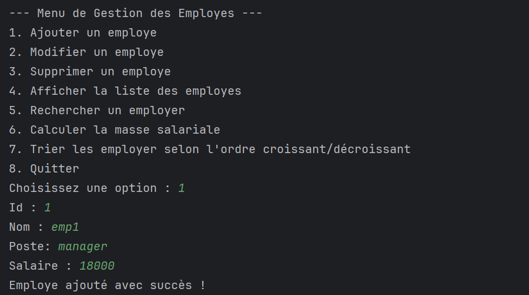

[//]: # (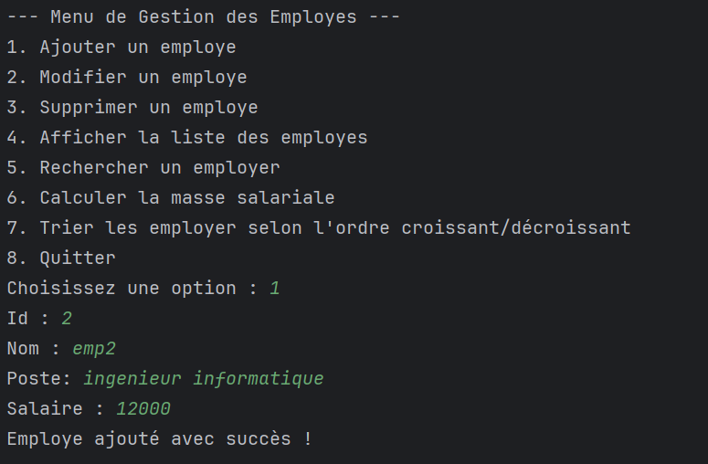)

[//]: # (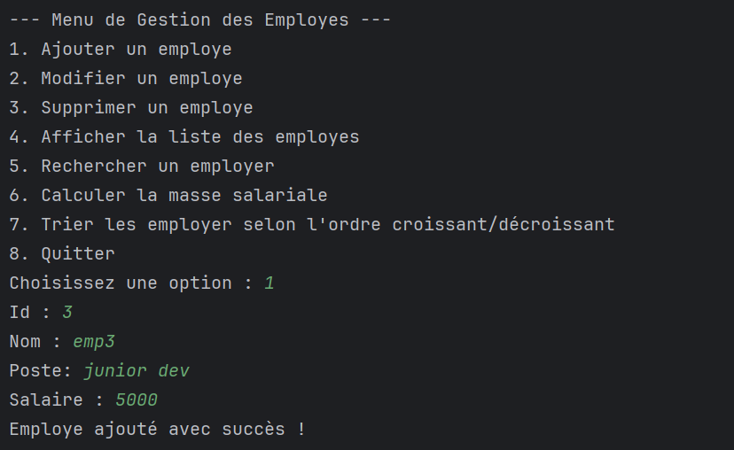)

[//]: # (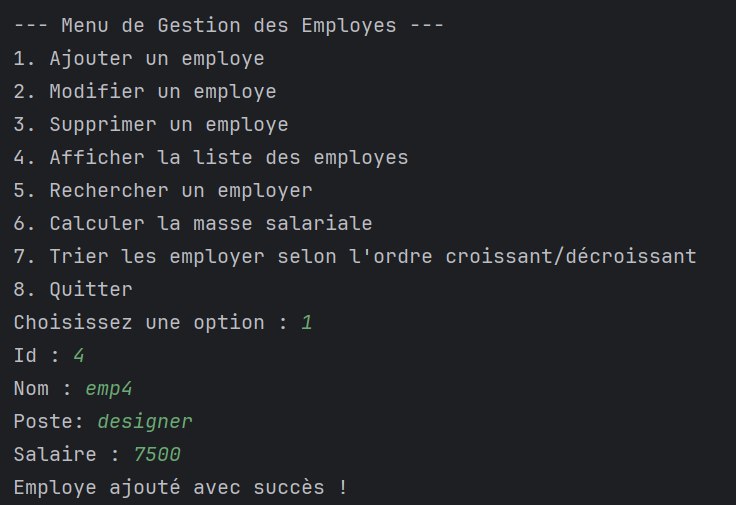)

<h2>Afficher la liste des Employes</h2>

Taper 4 pour lister les employes 

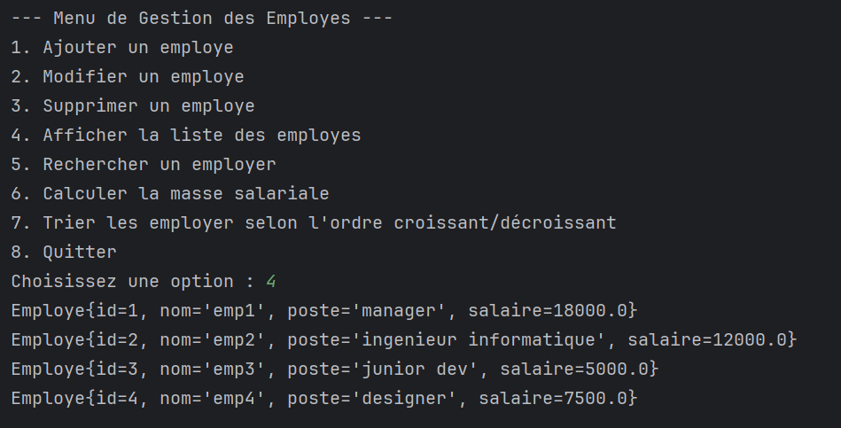

<h2>Modifier un Employe</h2>

Taper 2 pour modifier un employe 

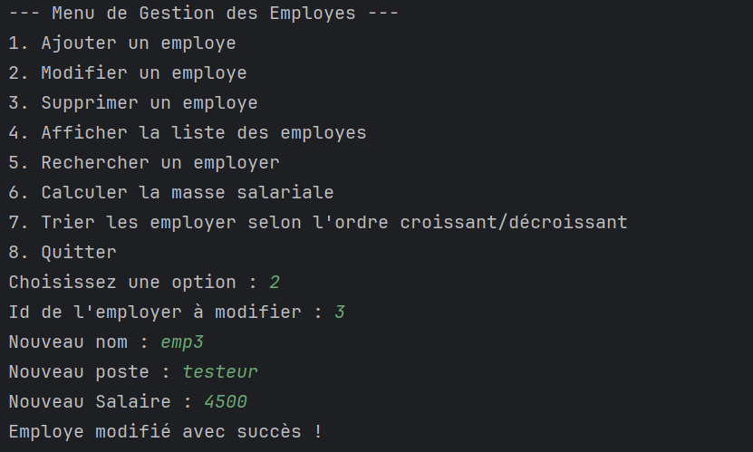 

<h2>Chercher un Employe</h2>

Taper 5 pour rechercher un employe 

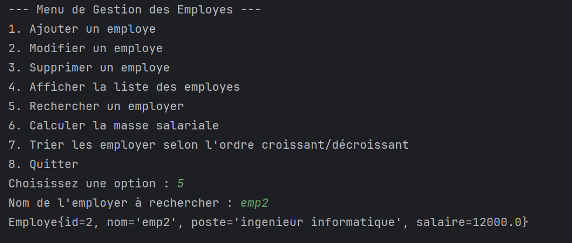

<h2>Calculer la masse salariale</h2>

Taper 6 pour calculer la masse salariale 

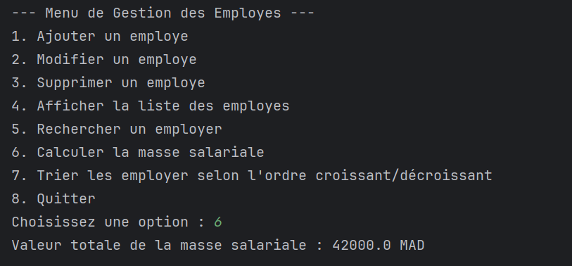

<h2>Trier les Employes en ordre croissant</h2>

Taper 7 et '>' pour trier en ordre les employes selon leurs salaires 

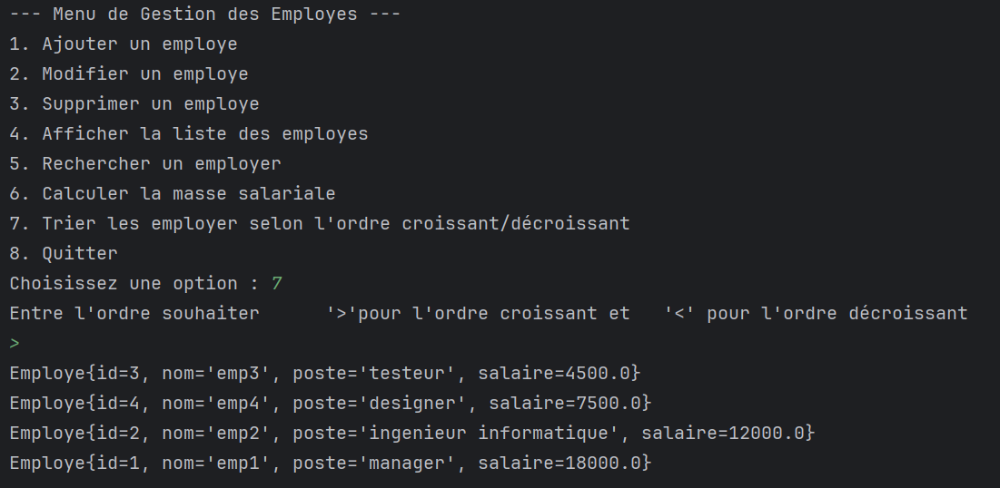

<h2>Trier les Employes en ordre decroissant</h2>

Taper 7 et '<' pour trier en ordre decroissant les employes selon leurs salaires 

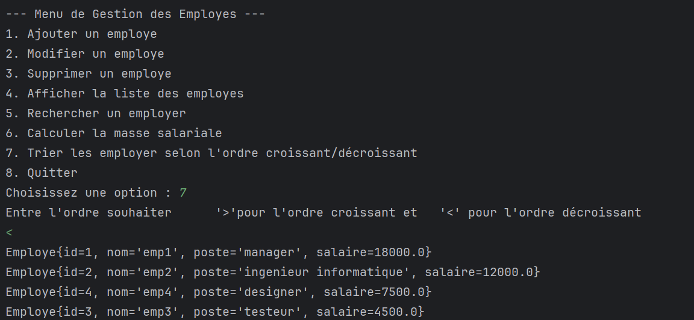

<h2>Supprimer un Employe</h2>

Taper 3 pour supprimer un Employe 

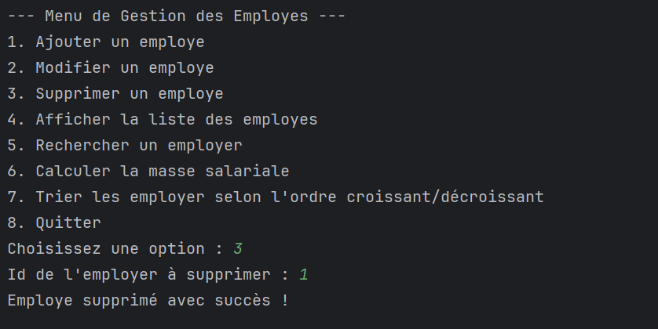

<h2>Quitter l'application</h2>

Taper 8 pour quitter l'application 

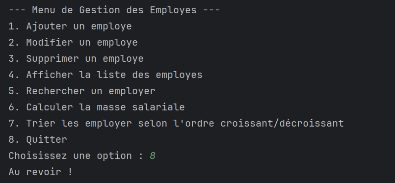